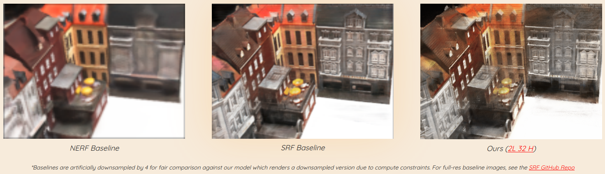
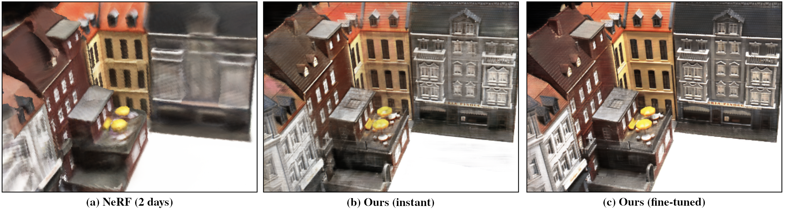

# Stereo Cross-Attention Radiance Fields (SCARF)

This is a modification of the original SRF paper, but using attention as the mechanism for implicit stereo correspondences.

Our website report with extended results can be found at [https://samleo8.github.io/SCARF/](https://samleo8.github.io/SCARF/).

## Authors

Samuel Leong (http://samleo8.github.io/) [Email: scleong at andrew.cmu.edu]

Alex Strasser [Email: arstrasse at andrew.cmu.edu]

## Results

Final presentation for the class is publicly viewable [here](https://docs.google.com/presentation/d/1BXCPMn_tfyXVVvL5m5Y0Ear06_MKOi1l6b6xrLuzZBk/edit?usp=sharing)

Website report can be found at [https://samleo8.github.io/SCARF/](https://samleo8.github.io/SCARF/).



## Install

A linux system with either [conda](https://www.anaconda.com/) or [pip](https://pypi.org/) is required for the project.

First, clone the repo.

```bash
git clone git@github.com:Samleo8/SCARF.git
cd SCARF
```

Then, install the dependencies with either pip

```bash
pip install -r requirements.txt
```

or with the "srf" conda environment

```
conda env create -f srf_env.yml
```

## Pretrained Models

Our pretrained SCARF models can be found in our publicly-accessible Google drive: [https://drive.google.com/drive/u/0/folders/1D-Ku0_liA_F2-CRVCK7figIN2BOSWrQY](https://drive.google.com/drive/u/0/folders/1D-Ku0_liA_F2-CRVCK7figIN2BOSWrQY). Please download them into the `./logs/` directory. The directory structure should look something like

```bash
 data/
 scripts/
 logs/
   |-- <EXP_NAME (eg. train_DTU_2L_32H)>/
       |-- training_visualizations/
       |-- tensorboard/
       |-- <CKPT_EPOCH>.tar
       |-- args.txt
       |-- config.txt
```

### Bash Scripts (recommended)

If you are on a system that supports bash/shell scripts, you can use the scripts in the `./scripts` folder to do basically everything.

#### Render Novel Views
To synthesise novel views of a pretrained model, use the following script

```bash
./scripts/render_finetune.sh [EXP_NAME [SCAN_NUMBER [POSE [CUDA_VISIBLE_DEVICES]]]] 
```

For example, to render the pretrained model for experiment `train_DTU_2L_32H` on pose 10 (choose from 0-51 inclusive) of scan 23, with CUDA device 2, use the following script

```bash
./scripts/render_finetune.sh train_DTU_2L_32H 23 10 2
```

There is also a script (`./scripts/render_finetune_multiple.sh`) for rendering multiple experiments across different GPUs, but requires that you modify the bash script to suit your needs.

#### 3D Reconstruction (WIP)

To generate a 3D reconstruction (mesh output) that will be saved in `./logs/<EXP_NAME>/mesh_colored_<SCAN>.obj`, 

```bash
./scripts/construct_3d.sh [EXP_NAME [SCAN_NUMBER [CUDA_VISIBLE_DEVICES]]]
```

To then view the mesh in Python, 

```bash
./scripts/view_3d.sh [EXP_NAME [SCAN_NUMBER [CUDA_VISIBLE_DEVICES]]]
```

For example, to 3d construct the pretrained model for `train_DTU_2L_32H` on pose 10 (choose from 0-51 inclusive) of scan 23, with CUDA device 2, you would run

```bash
./scripts/construct_3d.sh train_DTU_2L_32H 23 2
./scripts/view_3d.sh train_DTU_2L_32H 23 2
```

### Raw Python Code

To synthesise novel views of a pretrained and finetuned model use the following command
```
python generator.py --config configs/finetune_scan23.txt --generate_specific_samples scan23 --gen_pose 0
```

where `--gen_pose` is a camera pose of a video sequence from 0-51 (including both).
We also provide a second model that can be used by switching both "23" to "106" in the previous command.

In order to do a 3D reconstruction please run:
```
python 3d_reconstruction.py --config configs/finetune_scan106.txt --generate_specific_samples scan106
```

> Note: The above configuration uses a batch of 250 rays to render at once, which assumes a ~48GB GPU.
> Consider adjusting this number in case of memory issues, by adding `--N_rays_test X`, with a suited number X to 
> previous command. Smaller batches will lead to increased generation time. Moreover, RAM usage can be reduced by
> setting `--render_factor X` (with X=8 or 16) for image generation.


## Training

### Data Setup

Use the download script `./scripts/download_data.sh` to download the data, and have it save into the `./data/DTU_MVS/` directory.

Alternatively, use these commands. The [DTU MVS dataset](https://roboimagedata.compute.dtu.dk/?page_id=36) is downloaded and put in 
place.

```bash
wget http://roboimagedata2.compute.dtu.dk/data/MVS/Rectified.zip -P data/
unzip data/Rectified.zip -d data/
mv data/Rectified/* data/DTU_MVS
rmdir data/Rectified
```

### Start Training

To setup your own experiments, copy modify the config files in the `./configs` folder. Remember to change the `expname` variable to a unique name.

To start training, use the provided script

```bash
./scripts/train.sh [EXP_NAME [CUDA_VISIBLE_DEVICES (Def: all) [NUM_WORKERS (Def: nproc)]]]
```

For example, to train the model for experiment `train_DTU_2L_32H` on CUDA device 2, with 4 workers, use the following script

```bash
./scripts/train.sh train_DTU_2L_32H 2 4
```

#### Multi-GPU Training (EXPERIMENTAL)

This has not been tested, but it may be possible to train on multiple GPUs by removing the `--noparallel` flag in the `train.sh` script, and setting the `--batch_size` to the number of GPUs available.

#### Fine-tuning

Next we optimize a model trained in the previous step on a specific scene given by 11 test images.

Create a new experiment folder containing the trained model:

```bash
mkdir logs/start_finetuning_scan23
cp logs/train_DTU/<your-val-min-checkpoint>.tar logs/start_finetuning_scan23/
```

And start fine-tuning with:

```bash
python trainer.py --config configs/start_finetuning_scan23.txt
```

Initial improvements are obtained at 1k iterations, further improvements are obtained around 3k and 13k iterations.
After training, novel view synthesis and 3D reconstruction can be performed as seen in the above quickstart, but
specifying the corresponding configuration file.

To fine-tune on a different scan, say with ID X, copy the config file `configs/start_finetune_scan23.txt`

```bash
cp configs/start_finetune_scan23.txt configs/start_finetune_scanX.txt
```

and change "scan23" to "scanX" in the `expname`, `fine_tune` and `generate_specific_samples` variables of the
configuration, where X is the ID of the desired scan. Similarly, you'd need to change "scan23" to "scanX" in the above
experiment folder name.

---

## Original Paper/Authors

> [Julian Chibane](http://virtualhumans.mpi-inf.mpg.de/people/Chibane.html), 
> [Aayush Bansal](http://www.cs.cmu.edu/~aayushb/),
> [Verica Lazova](http://virtualhumans.mpi-inf.mpg.de/people/Lazova.html),
> [Gerard Pons-Moll](http://virtualhumans.mpi-inf.mpg.de/people/pons-moll.html) <br />
> Stereo Radiance Fields (SRF): Learning View Synthesis for Sparse Views of Novel Scenes <br />
> In IEEE Conference on Computer Vision and Pattern Recognition (CVPR), 2021



[Paper](https://virtualhumans.mpi-inf.mpg.de/papers/chibane21SRF/chibane21srf.pdf) - 
[Supplementaty](https://virtualhumans.mpi-inf.mpg.de/papers/chibane21SRF/chibane21srf_supp.pdf) -
[Video](https://virtualhumans.mpi-inf.mpg.de/srf/#video) -
[Project Website](https://virtualhumans.mpi-inf.mpg.de/srf/) -
[Arxiv](https://arxiv.org/abs/2104.06935) -
If you find our project useful, please cite us. [Citation (Bibtex)](https://virtualhumans.mpi-inf.mpg.de/srf/#citation)
## Contact

For questions and comments please contact [Julian Chibane](http://virtualhumans.mpi-inf.mpg.de/people/Chibane.html) via mail.

## License
Copyright (c) 2021 Julian Chibane, Max-Planck-Gesellschaft

By downloading and using this code you agree to the terms in the LICENSE.

You agree to cite the `Stereo Radiance Fields (SRF): Learning View Synthesis for Sparse Views of Novel Scenes` paper in 
any documents that report on research using this software or the manuscript.


<details>
  <summary> Show LICENSE (click to expand) </summary>
Please read carefully the following terms and conditions and any accompanying documentation before you download and/or use this software and associated documentation files (the "Software").

The authors hereby grant you a non-exclusive, non-transferable, free of charge right to copy, modify, merge, publish, distribute, and sublicense the Software for the sole purpose of performing non-commercial scientific research, non-commercial education, or non-commercial artistic projects.

Any other use, in particular any use for commercial purposes, is prohibited. This includes, without limitation, incorporation in a commercial product, use in a commercial service, or production of other artefacts for commercial purposes.
For commercial inquiries, please see above contact information.

THE SOFTWARE IS PROVIDED "AS IS", WITHOUT WARRANTY OF ANY KIND, EXPRESS OR IMPLIED, INCLUDING BUT NOT LIMITED TO THE WARRANTIES OF MERCHANTABILITY, FITNESS FOR A PARTICULAR PURPOSE AND NONINFRINGEMENT. IN NO EVENT SHALL THE AUTHORS OR COPYRIGHT HOLDERS BE LIABLE FOR ANY CLAIM, DAMAGES OR OTHER LIABILITY, WHETHER IN AN ACTION OF CONTRACT, TORT OR OTHERWISE, ARISING FROM, OUT OF OR IN CONNECTION WITH THE SOFTWARE OR THE USE OR OTHER DEALINGS IN THE SOFTWARE.

You understand and agree that the authors are under no obligation to provide either maintenance services, update services, notices of latent defects, or corrections of defects with regard to the Software. The authors nevertheless reserve the right to update, modify, or discontinue the Software at any time.

The above copyright notice and this permission notice shall be included in all copies or substantial portions of the Software.

</details>

